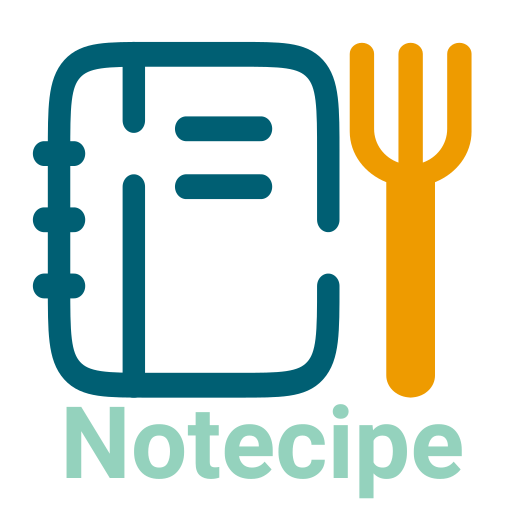
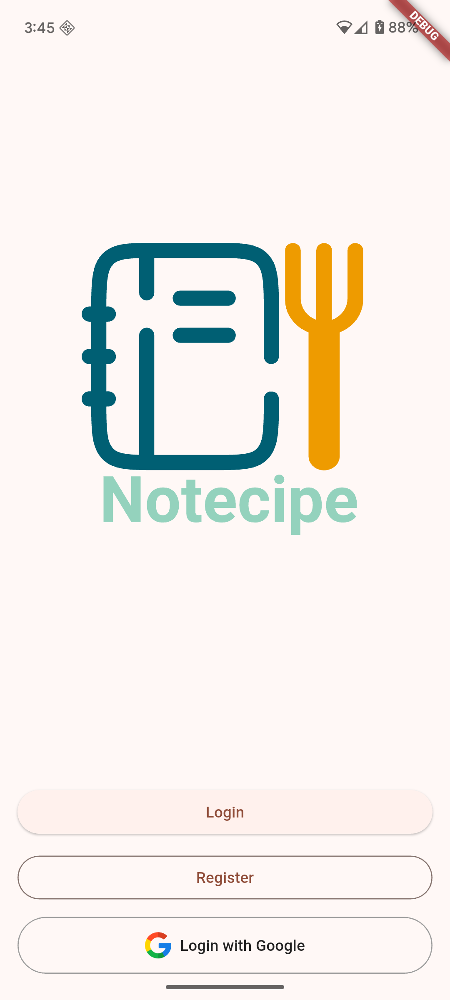

# Notecipe 



Notecipe is a beautifully designed, cross-platform Flutter app available on iOS, Android, and desktop platforms (Windows, macOS, Linux). It offers an easy, fun way to share your favorite recipes with friends and discover new culinary ideas.

---

## Features

- Share your own recipes with photos, ingredients, and step-by-step instructions.
- Browse and search a community-driven collection of recipes.
- Save your favorite recipes for quick access.
- Cross-platform support — enjoy the app on mobile devices and PCs.
- Simple, clean Material Design UI with smooth navigation and responsive layouts.
---

## Screenshots



*(Add more)*

---

## Getting Started

### Prerequisites

- Flutter SDK (version compatible with your app)
- Android Studio
- [Optional] Text editor like VS code

### Installation

1. Clone the repository
2. ```bash
    cd notecipe
    ```
3. flutter pub get
4. flutter run

## License

This project is licensed under the MIT License.

---

*Happy cooking and sharing!* 🍳🥘🍰

